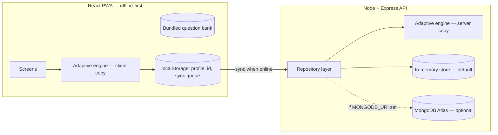

# Design Document — Foundational Learning Rescue

This is written before any implementation code, per the brief's own build order:
architecture → folder structure → data models → API endpoints → adaptive algorithm → build.

## 1. Architecture

Two independent apps, talking over a small REST API:



**Why the adaptive engine is duplicated, not just server-side:** the brief requires the
app to keep working with zero connectivity. If scoring only happened on the server, a
child with no signal couldn't get a diagnosis or adaptive practice at all. So the exact
same pure-function engine (`adaptiveEngine.js`) ships in both places:

- **Client** runs it immediately for instant feedback and to pick the next question,
  fully offline, against the question bank bundled into the PWA at build time.
- **Server** re-runs it over the raw attempt log whenever a session syncs, and is the
  source of truth for the parent dashboard. This also means a child can't inflate their
  own skill score by tampering with client state — the server never trusts a
  client-submitted score, only raw answers, and recomputes.

**Why an in-memory store by default:** this is a hackathon MVP judged live, often on
venue wifi. Requiring a real MongoDB Atlas cluster to be reachable during the demo is a
single point of failure. The repository layer (`services/repository.js`) picks a backend
at boot: if `MONGODB_URI` is set, it uses real Mongoose models; if not, it uses an
in-memory store with an identical function signature. Same routes, same behavior, zero
setup. Flip a single env var to point at real Atlas for anything beyond the demo.

**Why the "AI" in "AI-powered" is mostly deterministic:** the brief is explicit that the
core loop must not depend on an LLM. Diagnosis, difficulty adaptation, and error-pattern
detection are all plain, auditable, testable functions — important for something making
decisions about a child's learning path. The one generative-feeling piece (parent-facing
insight sentences) is template-based, not a model call, so it works fully offline and
never depends on an API key being present at demo time. A real LLM call (e.g. via the
Claude API) is a reasonable post-hackathon upgrade for that one piece and is noted as
such in the README — it is not needed for the MVP to be genuinely "AI-powered" in the
sense that matters here: it adapts to the individual child.

## 2. Folder structure

```
foundational-learning-app/
├── DESIGN.md
├── README.md
├── server/
│   ├── package.json
│   ├── .env.example
│   └── src/
│       ├── index.js                 # boot: connect DB (or not), start HTTP server
│       ├── app.js                   # express app, middleware, route mounting
│       ├── config/db.js             # mongoose connection w/ in-memory fallback
│       ├── data/
│       │   ├── questionBank.js      # every diagnostic/practice question, by skill+difficulty
│       │   └── seedDemoData.js      # one pre-populated demo student for instant dashboard
│       ├── models/                  # Mongoose schemas (used only when MONGODB_URI is set)
│       │   ├── Student.js
│       │   ├── SkillProfile.js
│       │   ├── Attempt.js
│       │   └── Session.js
│       ├── services/
│       │   ├── inMemoryStore.js     # default backend, same shape as the Mongo path
│       │   ├── repository.js        # picks in-memory vs Mongo, single import for routes
│       │   ├── adaptiveEngine.js    # scoring, difficulty staircase, error-pattern detection
│       │   └── insights.js          # template-based parent-friendly summaries
│       ├── routes/                  # one file per resource, thin — logic lives in services
│       └── middleware/errorHandler.js
└── client/
    ├── package.json
    ├── vite.config.js
    ├── tailwind.config.js
    ├── index.html
    ├── public/manifest.webmanifest
    └── src/
        ├── main.jsx
        ├── App.jsx                  # router + screen shell
        ├── lib/
        │   ├── api.js                # fetch wrapper + offline queue
        │   ├── speech.js              # useSpeech() — Web Speech API wrapper
        │   ├── offlineStore.js        # localStorage: profile, queue, cached results
        │   ├── studentId.js
        │   ├── questionBank.js        # mirrors server/src/data/questionBank.js
        │   └── adaptiveEngine.js      # mirrors server/src/services/adaptiveEngine.js
        ├── context/AppContext.jsx     # student id, skill profile, session state
        ├── components/
        │   ├── ui.jsx                 # BigButton, ProgressBar, StarRating, SpeakerButton…
        │   └── QuestionRunner.jsx      # shared question+feedback flow (diagnostic & practice)
        └── screens/                   # Welcome, ProfileSetup, SubjectSelect, Diagnostic,
                                        # DiagnosticResult, SkillMap, DailyRescue,
                                        # SessionComplete, Progress, ParentDashboard
```

## 3. Data models

Five skills per subject, matching the brief's own skill-map example exactly:

```
LITERACY  = letterRecognition, letterSounds, wordReading, sentenceReading, comprehension
NUMERACY  = numberRecognition, counting, addition, subtraction, multiplication
```

**Student**
```
{ studentId (uuid), nickname, avatarId, createdAt }
```
No name, no photo, no location. `studentId` is a random UUID generated client-side at
profile creation and is the only identifier used anywhere in the system.

**SkillProfile** (one per student)
```
{
  studentId,
  literacy:  { letterRecognition, letterSounds, wordReading, sentenceReading, comprehension },  // 0–100 each
  numeracy:  { numberRecognition, counting, addition, subtraction, multiplication },              // 0–100 each
  updatedAt
}
```

**Attempt** (one per question answered — the raw log everything else is derived from)
```
{
  studentId, sessionId, subject, skill, questionId, difficulty (1|2|3),
  answer, correct (bool), responseTimeMs, errorPattern (string|null),
  createdAt
}
```

**Session** (one per diagnostic run or Daily Rescue)
```
{
  studentId, type ('diagnostic'|'rescue'), subject, skill (rescue only),
  startedAt, completedAt, questionCount, correctCount, starsEarned,
  skillScoreBefore, skillScoreAfter
}
```

Storing the raw `Attempt` log (not just rolling scores) is what makes error-pattern
detection and "improvement over time" charts possible after the fact, and lets the
server recompute scores independently of the client.

## 4. API endpoints

All under `/api`. No endpoint ever asks for or returns a real name, photo, or location.

| Method | Path | Purpose |
|---|---|---|
| POST | `/students` | Create an anonymous student (nickname + avatar only) |
| GET | `/students/:id` | Fetch basic student info |
| GET | `/questions/:subject` | Full question bank for `literacy`\|`numeracy`, for caching |
| POST | `/diagnostic/:studentId/submit` | Submit raw diagnostic attempts → server recomputes skill profile, returns weakest skill + recommendation |
| GET | `/skill-profile/:studentId` | Current skill map |
| GET | `/practice/next/:studentId?subject=` | Generates the next "Daily Rescue": target skill + 5 questions at the right difficulty |
| POST | `/practice/:studentId/submit` | Submit a rescue session's attempts → updated scores, stars, badges |
| GET | `/progress/:studentId` | Score history over time, for charts |
| GET | `/dashboard/:studentId` | Aggregated parent/teacher view: both skill maps, weakest areas, trend, plain-language insight |
| POST | `/sync/:studentId` | Flush a batch of offline-queued diagnostic/rescue submissions |

## 5. Adaptive algorithm (deterministic — no LLM in this path)

**Scoring a skill.** Every answer moves that skill's 0–100 mastery score. Getting an
*easy* item wrong costs more than getting a *hard* item wrong (missing something easy is
a stronger signal of a gap); getting a *hard* item right earns more than an easy one:

```
STEP_UP   = { easy: +6,  medium: +10, hard: +15 }   // on correct
STEP_DOWN = { easy: -14, medium: -9,  hard: -5  }   // on incorrect
score = clamp(score + (correct ? STEP_UP[difficulty] : STEP_DOWN[difficulty]), 0, 100)
```

New students start each skill at 50 (unknown), so a handful of answers is enough to
separate "solid" from "shaky" — two easy items wrong drops a skill to 22, two hard items
right lifts it to 80 — which is what keeps the diagnostic to 2–4 minutes instead of
requiring dozens of items per skill for statistical confidence. The step sizes are
deliberately capped in the 5–15 point range rather than higher: a mastery score is meant
to represent a trend across days of short sessions, and if a single 5-question Daily
Rescue could swing a score by 100 points, one lucky or unlucky streak would look
indistinguishable from real, consolidated learning. A typical rescue session (a mix of
hits and misses) moves a score by roughly 10–25 points — enough to feel rewarding in one
sitting, not so much that it stops meaning anything.

**Diagnostic flow.** Skills are tested in their natural developmental order (a child who
can't recognize letters yet shouldn't be given a sentence-comprehension question). Two
items per skill, the second one's difficulty chosen from the first answer. The whole
diagnostic ends the moment the child gets **two answers in a row wrong anywhere** —
that's the "repeated errors" trigger from the brief — and every skill from that point on
is marked as an untested likely gap rather than being tested to exhaustion. This is what
keeps the assessment short *and* is exactly how the demo script ("makes repeated
mistakes in one skill → system identifies exact weakness") plays out mechanically, not
as a scripted fake. If the child instead clears the whole diagnostic, the lowest-scoring
skill is still surfaced as the practice recommendation.

**Practice difficulty staircase (Daily Rescue).** Starting difficulty comes from the
current skill score (<40 → easy, 40–70 → medium, >70 → hard). Two correct in a row steps
difficulty up; one wrong steps it down; two wrong in a row drops straight to easy. This
is a standard, explainable step algorithm (not full IRT/Bayesian) — appropriate for an
MVP where a teacher should be able to look at the rule and trust it.

**Error-pattern detection.** Numeracy questions carry metadata (`requiresBorrow`,
`requiresCarry`) alongside their operands. When an answer is wrong, the engine checks it
against the *specific wrong answer a borrowing/carrying mistake would produce* (naive
column-wise subtraction/addition ignoring the borrow/carry) — if it matches, the error is
tagged `borrowing-error` or `carrying-error` rather than just "wrong." Off-by-one answers
are tagged `counting-slip`. Literacy multiple-choice options carry an optional
`confusion` tag (e.g. `b-d-reversal`) so picking a commonly-confused distractor is logged
as that specific confusion, not generic incorrectness. This is what lets the skill map
and parent dashboard say *what kind* of mistake is recurring, not just a percentage.

All of the above lives in `adaptiveEngine.js` as small, pure, synchronous functions with
no I/O — easy to unit test and easy for a hackathon teammate to read in one sitting.
